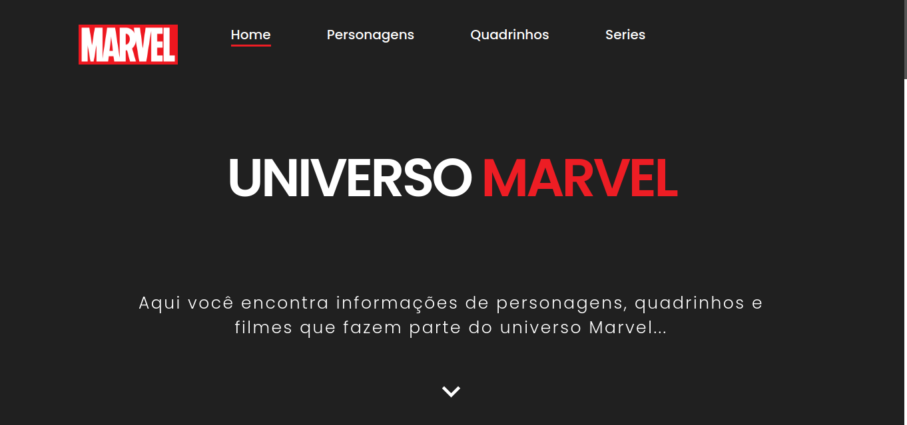
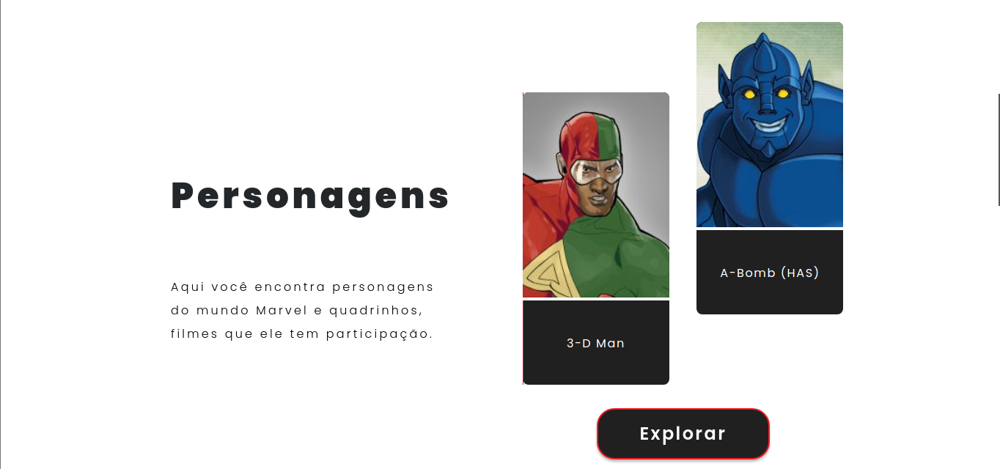
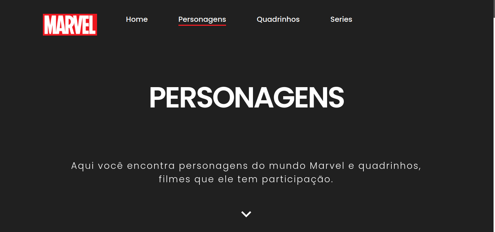
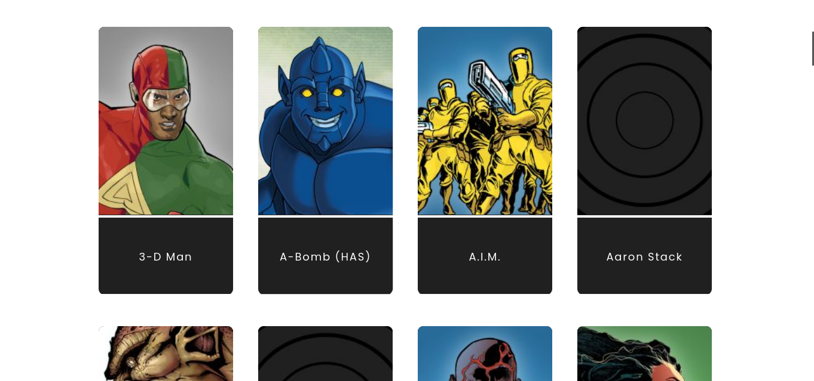

<h1 align="center">
    
</h1>

<h4 align="center"> 
	UNIVERSO MARVEL
</h4>
 
<p align="center">
  
  
  
  
  <a href="https://www.linkedin.com/in/paulobeckman/">
    
  </a>
	
  
  <a href="https://github.com/paulobeckman/Universo-Marvel/commits/master">
    
  </a>

  
   <a href="https://github.com/paulobeckman/Universo-Marvel/stargazers">
    
  </a>
</p>


## 💻 Sobre o projeto

Universo marvel é um projeto que você encontra informações de personagens, quadrinhos e series que fazem parte do universo Marvel.

As informações sobre personagens, quadrinhos e series são fornecidas pela api da marvel. Com isso, as informações na site são distribuidas da seguinte forma:
- Página Home: 
  - Aqui você pode encontra um resumo do site, apresentando cards e descrições.

- Página Personagens: 
  - Aqui é encontrado 50 cards de personagens com imagem e titulo. Ao clicar em um dos cards você é redirecionado para saber mais sobre o personagem escolhido e são apresentadas informações como quadrinhos e series relacionados.

- Página Quadrinhos:
  - Aqui é encontrado 50 cards de quadrinhos com imagem e titulo. Ao clicar em um dos cards você é direcionado para saber mais sobre o quadrinho escolhido e são apresentadas informações como criadores e series relacionados.

- Página Series:
  - Aqui é encontrado 50 cards de series com imagem e titulo. Ao clicar em um dos cards você é direcionado para saber mais sobre a serie escolhida e são apresentadas informações como criadores e quadrinhos relacionados.

O site conta com animações feitas com css e também com o [ScrollrevealJS][bJS].

## 🎨 Layout

O layout da aplicação está disponível no Figma:

<a href="https://www.figma.com/file/v51VByfCPORMuiG9SVoJqi/Marvel?node-id=0%3A1">
  
</a>


### Web

<p align="center" style="display: flex; align-items: flex-start; justify-content: center;">
	
  	
		
  

  

  

  
</p>

## 🛠 Tecnologias

As seguintes ferramentas foram usadas na construção do projeto:

- [Node.js][nodejs]
- [CSS][css]
- [HTML][HTML]
- [JavaScript][JavaScript]
- [Nunjucks][Nunjucks]
- [ScrollrevealJS][bJS]


## 🚀 Como rodar este projeto

### Pré-requisitos

Antes de começar, você vai precisar ter instalado em sua máquina as seguintes ferramentas:
[Git](https://git-scm.com), [Node.js][nodejs]. 
Além disto é bom ter um editor para trabalhar com o código como [VSCode][vscode]

### 🎲 Rodando a aplicação web

```bash
# Clone este repositório
$ git clone https://github.com/paulobeckman/Universo-Marvel.git

# Acesse a pasta do projeto no terminal/cmd
$ cd Universo-Marvel

# Instale as dependências
$ npm install

# Execute a aplicação em modo de desenvolvimento
$ npm start

# O servidor inciará na porta:3000 - acesse http://localhost:3000 
```


## 📝 Licença

Este projeto esta sobe a licença MIT. Veja a [LICENÇA](license) para saber mais.

Feito por Paulo Beckman 👋🏽 [Entre em contato!](https://www.linkedin.com/in/paulobeckman/)

[nodejs]: https://nodejs.org/
[npm]: https://www.npmjs.com/
[vscode]: https://code.visualstudio.com/
[vceditconfig]: https://marketplace.visualstudio.com/items?itemName=EditorConfig.EditorConfig
[license]: https://opensource.org/licenses/MIT
[vceslint]: https://marketplace.visualstudio.com/items?itemName=dbaeumer.vscode-eslint
[prettier]: https://marketplace.visualstudio.com/items?itemName=esbenp.prettier-vscode
[CSS]: https://developer.mozilla.org/pt-BR/docs/Web/CSS
[HTML]: https://developer.mozilla.org/pt-BR/docs/Web/HTML
[JavaScript]: https://developer.mozilla.org/pt-BR/docs/Aprender/JavaScript
[Nunjucks]: https://www.npmjs.com/package/nunjucks
[bJS]: https://scrollrevealjs.org/